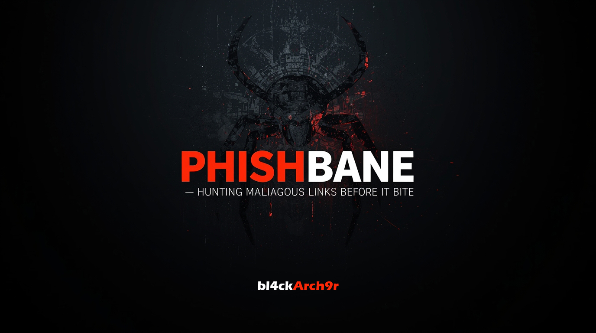

# PhishBane v0.2 - Rule-based Phishing URL Analyzer

PhishBane is a cybersecurity tool for detecting phishing URLs using **advanced rule-based heuristics**. It assigns risk scores, labels, and reasons for each analyzed URL. Designed for both personal and organizational use, it provides a **modern web dashboard, API access, and Docker deployment**.

 

  

## Key Features
- **URL Risk Analysis:** Scores URLs from 0 to 100 based on suspicious patterns and phishing indicators.
- **URL Classification:** Labels each URL as Safe, Suspicious, or Malicious.
- **Explainable Detection:** Shows why a URL is flagged, including suspicious keywords, domain anomalies, and path structure.
- **Web Dashboard:** Scan URLs easily, view detailed results, and generate reports.
- **API Access:** FastAPI endpoints enable integration with automated scripts or other cybersecurity tools.
- **Extensible Design:** Add new rules, integrate ML classifiers, or customize the detection engine.
- **Dockerized Deployment:** Run locally or in containers for simple and reproducible setups.

  

  

 

## Technologies
- **Backend:** Python, FastAPI  
- **Frontend:** HTML, CSS, JavaScript  
- **Data Analysis:** Python rules engine (future ML extension with scikit-learn)  
- **Deployment:** Docker, docker-compose  

